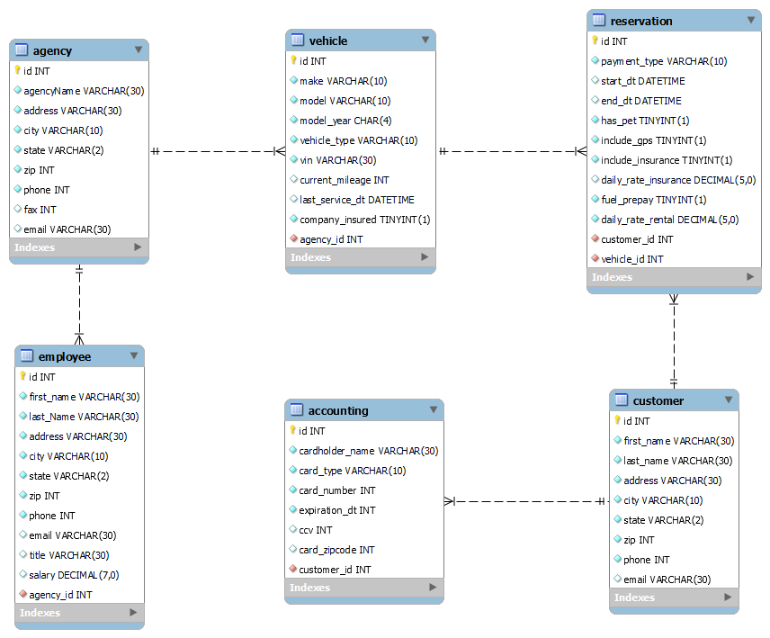

# Chitty Chitty Bang Bang Rental Agency ("CCBBRA")

## Summary

[CCBBRA](https://ckinleydavis.github.io/ccbbra/) was developed by Nicholas Herold, Ahmad Kane and Carla Kinley-Davis in 2021 during the global COVID-19 pandemic. The application is meant to address the needs of the traveler who is looking for a rental car during the current vehicle shortage due to months of economic shutdown. 

## Run the Application

## Development Workflow

### _ER Diagram_
<blockquote>

  

</blockquote> 

## Feedback

There are many ways in which you can participate in this project, for example:

* [Submit an Issue](https://github.com/ckinleydavis/ccbbra/issues)

* [Roadmap / Request New Features](https://github.com/ckinleydavis/ccbbra/wiki)

* Ask a question . . .

## License

Copyright &nbsp;(c)&nbsp; 2021 &nbsp;| &nbsp;CCBBRA&nbsp; | &nbsp;All Rights Reserved
